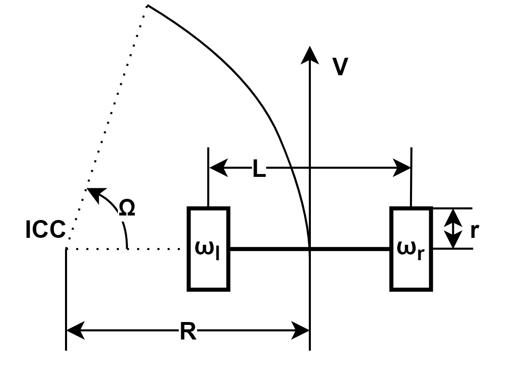
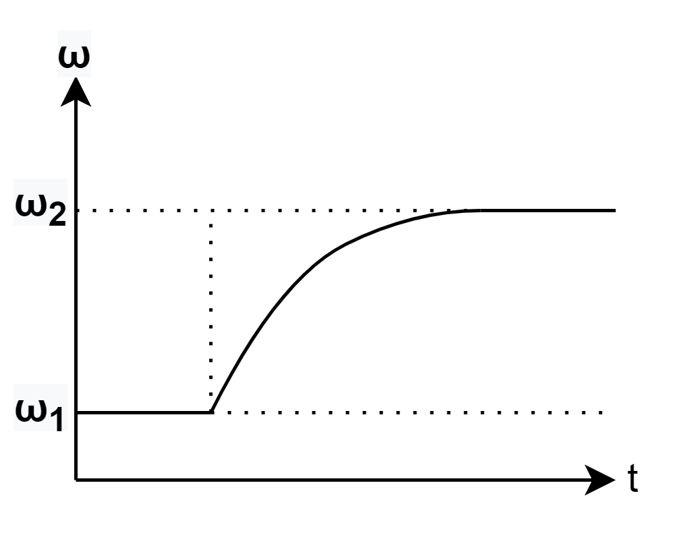
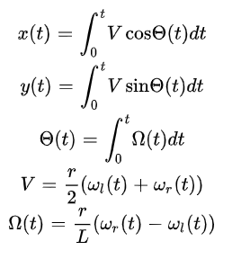
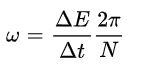
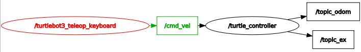

# Оглавление
1. Что за работа?
2. Ход работы
3. Листинг кода
# Глава 1: "Что за работа?"
В данной работе требовалось написать программу в операционной системе ROS для симуляции робота с дифференциальным приводом.
На входе прогрмма получает значений линеной и угловой скорости робота. Из этой информации программа должна рассчитать значения энкодеров левого и правого колеса, а текущие положение робота.


V и Ω программа получает на вход. L и r представляют информацию о физических данных робота (длина между колесами и радиус колёс). 
```
  L = 0.287
  r = 0.033
  ICC - мгновенный центр скоростей 
  Ω - угловая скорость вращения центра робота вокруг МЦС 
  R - расстояние от МЦС до центра робота 
  L - расстояние между колесами 
  r - радиус колес 
  V - линейная скорость робота 
  ω - угловые скорости колес
```
Также программа симлирует разгон колес до заданной скорости. Для симуляции такого процесса была выбранна переходная характеристика аппериодического звена.
 
 где:
 ```
   ω1 - начальная угловая скорость
   ω2 - расчитанная целевая угловая скорость колеса
 ```
Для расчета значений угла поворота робота, а также его положения были применены следующие формулы


Для расчета значений энкодеров была применена следующая формула



где:
```
  ΔE - разница между показаниями энкодера на текущей и предыдущей итерациях 
  Δt - время между измерениями 
  N - разрешение энкодера
```

# Глава 2: "Ход работы"
Для запуска программы требуется скачать папку под названием ```my_robot_controller``` в папку ```src``` вашего рабочего пространства. 
При вводе следующих команд
```
  $ cd catkin_ws/src/my_robot_controller/
  $ ls
```
Должен появится перечень файлов 
```
  CMakeLists.txt
  msg
  package.xml
  scripts
  src
```
Для запуска программы в командную строку следует ввести ```rosrun my_robot_controller turtle_controller.py```
После этого при вводе в командную строку ```rtq_graph``` мы должны получить следующий граф зависимостей


Данный граф показывает, что на вход мы получаем значения скоростей, а на выходе получаем два топика. ```/topic_odom``` выводит показания одометрии (положение робота по координатам x,y,z). Топик ```/topc_ex``` выводит показания энкодеров.
